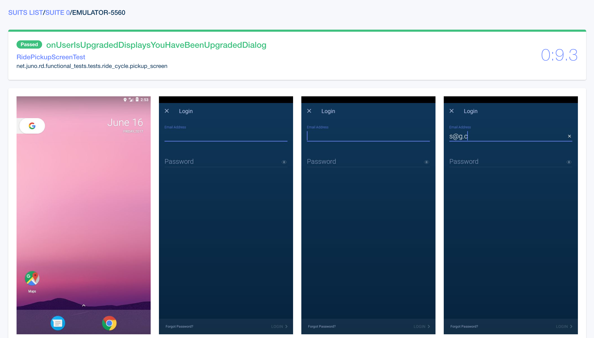

## Composer — Reactive Android Instrumentation Test Runner.

Composer is a modern reactive replacement for [square/spoon][spoon] with following feature set:

* Parallel test execution on multiple emulators/devices with [test sharding][test sharding] support.
* Logcat output capturing per test and for whole test run as well.
* Screenshots and files pulling for each test reactively (with support for [square/spoon][spoon] folder structure).
* JUnit4 report generation. 


### Table of Contents

- [Why we've decided to replace square/spoon](#why-weve-decided-to-replace-squarespoon)
- [HTML Report](#html-report)
- [Usage](#usage)
- [Download](#download)
- [3rd-party Composer Gradle Plugin](#3rd-party-composer-gradle-plugin)
- [Swarmer](#swarmer)
- [How to build](#how-to-build)
- [License](#license)

### Why we've decided to replace [square/spoon][spoon]
 
**Problem 1:** Our UI tests are stable, but we saw a lot of UI tests build failures. About ~50% of our CI builds were failing. All such failures of UI tests came from Spoon not being able to run tests on one or more emulators (device is red in the report and error message is `…work/emulator-5554/result.json (No such file or directory)`, basically it timed out on installing the apk on a device, increasing adb timeout did not help, all emulators responded to adb commands and mouse/keyboard interactions, we suppose problem is in in ddmlib used by Spoon.

**Solution:** Composer does not use ddmlib and talks to emulators/devices by invoking `adb` binary.  

**Problem 2:** Pretty often when test run finished, Spoon freezed on moving screenshots from one of the emulators/devices. Again, we blame ddmlib used in Spoon for that.

**Solution:** Composer invokes `adb` binary to pull files from emulators/devices, we haven't seen problems with that in more than 700 builds on CI.

**Problem 3:** Spoon pulled screenshots/files *after* finish of the whole test run on a device which slows down builds: `test_run_time + pull_files_time`.

**Solution:** Composer pulls screenshots/files *reactively* after each test which basically leads to: `~test_run_time`.

**Problem 4:** If test sharding is enabled (which we do all the time), Spoon HTML report is very hard to look at, especially if you want to find some particular test(s) and it's not failed. You have to either hover mouse over each test to find out its name or go into html/xml source and find on which emulator/device test was sharded in order to click on correct device and then find test by CMD+F on the page.

**Solution:** HTML report we've built designed with usability and performance in mind.
  
**Problem 5:** Html report can be very slow to load if you have lots of screenshots (which we do) since it displays all the screenshots of tests that were run on a particular device on a single page — it can take up to minutes to finish while you effectively unable to scroll page since scroll is jumping up and down each time new screenshot loaded.

**Solution:** HTML report that we've built does not display screenshots on index and suite pages, screenshots are displayed only on the test page → fast page load.

>With Composer we were able to make UI tests required part of CI for Pull Requests.
>It's fast, reliable and uses RxJava which means that it's relatively easy to add more features combining complex async transformations. 

### HTML Report

Our Frontend Team [helped us](https://github.com/gojuno/composer/issues/11) build HTML Report for the Composer. 

>It's fast, small and designed in collaboration with our QAs and Developers who actually use it on daily basis to make it easy to use.

Here are few screenshots:

[](demo/screenshot1.png) [](demo/screenshot2.png)[](demo/screenshot3.png)

## Usage

Composer shipped as jar, to run it you need JVM 1.8+: `java -jar composer-latest-version.jar options`. 

#### Supported options

##### Required

* `--apk`
  * Either relative or absolute path to application apk that needs to be tested.
  * Example: `--apk myapp.apk`
* `--test-apk`
  * Either relative or absolute path to apk with tests.
  * Example: `--test-apk myapp-androidTest.apk`

##### Optional

* `--help, -help, help, -h`
  * Print help and exit.
* `--test-runner`
  * Fully qualified name of test runner class you're using. 
  * Default: automatically parsed from `--test-apk`'s `AndroidManifest`. 
  * Example: `--test-runner com.example.TestRunner`
* `--shard`
  * Either `true` or `false` to enable/disable [test sharding][test sharding] which statically shards tests between available devices/emulators. 
  * Default: `true`.
  * Example: `--shard false`
* `--output-directory`
  * Either relative or absolute path to directory for output: reports, files from devices and so on. 
  * Default: `composer-output` in current working directory.
  * Example: `--output-directory artifacts/composer-output`
* `--instrumentation-arguments`
  * Key-value pairs to pass to Instrumentation Runner.
  * Default: empty.
  * Example: `--instrumentation-arguments myKey1 myValue1 myKey2 myValue2`.
* `--verbose-output`
  * Either `true` or `false` to enable/disable verbose output for Composer. 
  * Default: `false`.
  * Example: `--verbose-output true`
* `--keep-output-on-exit`
  * Either `true` or `false` to keep/clean temporary output files used by Composer on exit. 
  * Default: `false`.
  * Composer uses files to pipe output of external commands like `adb`, keeping them might be useful for debugging issues. 
  * Example: `--keep-output-on-exit true`
* `--devices`
  * Connected devices/emulators that will be used to run tests against.
  * Default: empty, tests will run on all connected devices/emulators.
  * Specifying both `--devices` and `--device-pattern` will result in an error.
  * Example: `--devices emulator-5554 emulator-5556`
* `--device-pattern`
  * Connected devices/emulators that will be used to run tests against.
  * Default: empty, tests will run on all connected devices/emulators.
  * Specifying both `--device-pattern` and `--devices` will result in an error.
  * Example: `--device-pattern "emulator.+"`
* `--install-timeout`
  * APK installation timeout in seconds. 
  * Default: `120` seconds (2 minutes). 
  * Applicable to both test APK and APK under test. 
  * Example: `--install-timeout 20`

##### Example

Simplest :
```console
java -jar composer-latest-version.jar \
--apk app/build/outputs/apk/example-debug.apk \
--test-apk app/build/outputs/apk/example-debug-androidTest.apk
```

With arguments :
```console
java -jar composer-latest-version.jar \
--apk app/build/outputs/apk/example-debug.apk \
--test-apk app/build/outputs/apk/example-debug-androidTest.apk \
--test-runner com.example.test.ExampleTestRunner \
--output-directory artifacts/composer-output \
--instrumentation-arguments key1 value1 key2 value2 \
--verbose-output false \
--keep-output-on-exit false
```

### Download

Composer is [available on jcenter](https://jcenter.bintray.com/com/gojuno/composer).

>You can download it in your CI scripts or store it in your version control system (not recommended).

```console
COMPOSER_VERSION=some-version
curl --fail --location https://jcenter.bintray.com/com/gojuno/composer/composer/${COMPOSER_VERSION}/composer-${COMPOSER_VERSION}.jar --output /tmp/composer.jar
```

All the releases and changelogs can be found on [Releases Page](https://github.com/gojuno/composer/releases).

### 3rd-party Composer Gradle Plugin

[@trevjonez](https://github.com/trevjonez) [built](https://github.com/gojuno/composer/issues/77) 🎉 [Gradle Plugin for Composer](https://github.com/trevjonez/composer-gradle-plugin) which allows you to configure and run Composer with Gradle.

### Swarmer

Composer works great in combination with [Swarmer][swarmer] — another tool we've built at Juno. 

[Swarmer][swarmer] can create and start multiple emulators in parallel. In our [CI Pipeline][ci pipeline] we start emulators with Swarmer and then Composer runs tests on them.

### How to build

#### All-in-one script (used in Travis build)

Dependencies: `docker` and `bash`.

```console
ci/build.sh
```

#### Build Composer

Environment variable `ANDROID_HOME` must be set.

```console
./gradlew build
```

#### Build HTML report module

Dependencies: `npm` and `nodejs`.

```console
cd html-report
npm install
npm build
```

## License

```
Copyright 2017 Juno, Inc.

Licensed under the Apache License, Version 2.0 (the "License");
you may not use this file except in compliance with the License.
You may obtain a copy of the License at

   http://www.apache.org/licenses/LICENSE-2.0

Unless required by applicable law or agreed to in writing, software
distributed under the License is distributed on an "AS IS" BASIS,
WITHOUT WARRANTIES OR CONDITIONS OF ANY KIND, either express or implied.
See the License for the specific language governing permissions and
limitations under the License.
```

[spoon]: https://github.com/square/spoon
[test sharding]: https://developer.android.com/training/testing/junit-runner.html#sharding-tests
[swarmer]: https://github.com/gojuno/swarmer
[ci pipeline]: https://github.com/gojuno/engineering/tree/master/articles/ci_pipeline_and_custom_tools_of_android_projects
